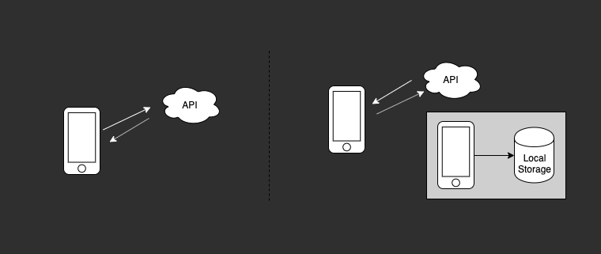
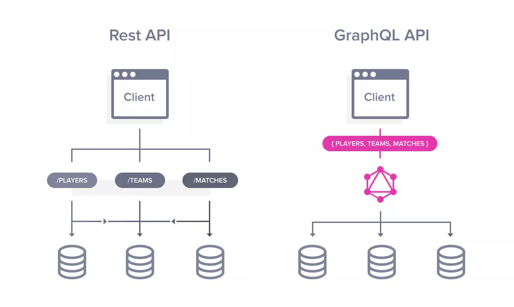
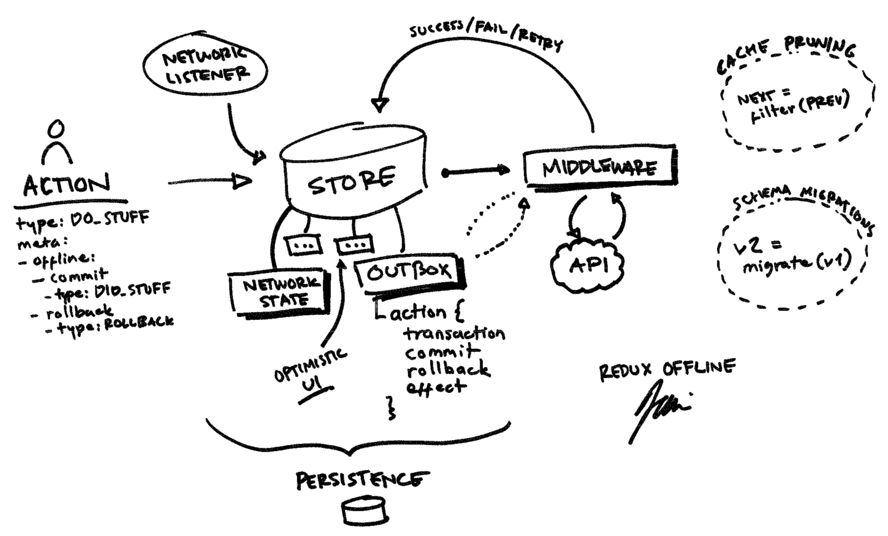

theme: New Story

# Offline Strategies

## React Native

^ Let's take a look at why offline matters for mobile apps and look at some strategies that will help you build robust and performant offline first mobile apps.

--- 

# Tim Whitacre

## Engineering Manager @ New Story Charity

> We pioneer solutions to end global homelessness.

### :sparkles: [@timwco](https://twitter.com/timwco)

### :sparkles: [@newstorycharity](https://twitter.com/newstorycharity)

---

# Why Offline First & Why Now?

* Connected & Powered to Disconnected & Battery
* Geography plays an important role
* Offline is simply a fact of life. :thumbsup:

--- 

# Problems

- Local Data Loss
- Offline is treated like a bad thing :thumbsdown:
- Data Conflicts
- Diverse Data Types
- Others [^1]

[^1]: https://alistapart.com/article/offline-first

--- 

# Offline Options & Decisions

- Real Time
  - Data Syncs Upon Connection
- Manual
  - Manually preform a sync operation


---

# Solutions

> Offline first requires a mix of UX and Development Strategies :fire:

... basically, don't skip the UX part

---

# How Do Offline Apps Work? 



--- 

# Offline Strategies (Tools)

- GraphQL
- Redux Offline (Local Storage)
- Realm

--- 

# GraphQL

### Only get the data that we need. Less queries, less operations and quicker access to data.




#### [Image Credit](https://devopedia.org/graphql)

---

# Redux Offline

### Redux Offline allows us to store and "rehydrate" our state as needed. It gives us deep control over how our data is stored and managed.




#### [Image Credit](https://hackernoon.com/introducing-redux-offline-offline-first-architecture-for-progressive-web-applications-and-react-68c5167ecfe0)

---

```javascript
// Store Configure
import { createStore, applyMiddleware, compose } from 'redux';
import { persistStore, persistReducer } from 'redux-persist';
import storage from 'redux-persist/lib/storage';
import { createOffline } from '@redux-offline/redux-offline';
import offlineConfig from '@redux-offline/redux-offline/lib/defaults';
import reducers from './reducers';

const { middleware, enhanceReducer, enhanceStore } = createOffline({ ...offlineConfig, persist: false });

export default (key: string) => {

  const persistConfig = { key, storage, blacklist: ['offline', 'user'] };

  const persistedReducer = persistReducer(persistConfig, enhanceReducer(reducers));

  const store = createStore( persistedReducer, compose( enhanceStore, applyMiddleware(middleware)));

  const persistor = persistStore(store);

  return { store, persistor };
};
```

---

```javascript
// App.js
import { Provider as ReduxProvider } from 'react-redux';
import { PersistGate } from 'redux-persist/integration/react';
import configureStore from 'utilities/configure-store';

class App extends Component<Props, State> {
  render () {
    const orgId = getOrganizationId();
    const { store, persistor } = configureStore(orgId);   

    return (
      <ReduxProvider store={store}> // Standard Redux Provider
        <PersistGate persistor={persistor}> // Delays rendering of app
          <MainAppNavigation />
        </PersistGate>
      </ReduxProvider>
    );
  }
}
```

---

Local Storage

```javascript
{

  org_1234: {
    app_status: { last_upload: '2019-09-03T20:59:05+00:00' },
    current_user: { name: 'Stacy', token: 'ABCDEF123456' },
    data: { ... }
  },

  org_5678: {
    app_status: { last_upload: '2019-09-03T20:59:05+00:00' },
    current_user: { name: 'Ikenna', token: 'HIJKLMNO789' },
    data: { ... }
  }

}
```

_See a potential problem...?_

---

# Realm

> Realm Database is a fast, easy to use, and open source alternative to SQLite and Core Data.

* Allows us to define a schema
* Loads data on new threads
* Security FTW :tada:
* Realtime data updates

---

```javascript
// Realm Setup
import models from './db/models'; // { Posts, Comments, Tags, Categories }

const database = async (orgId, schemaVersion) => {

  if (orgId === 'guest') return null; // If no user, no need for a database
  
  const schema = Object.values(models);

  const config = { schema, path: `${orgId}.realm`, schemaVersion };

  return await Realm.open(config);
};
```

---

```javascript
// App.js
import { Provider as ReduxProvider } from 'react-redux';
import { PersistGate } from 'redux-persist/integration/react';
import configureStore from 'utilities/configure-store';
import realmSetup from 'utilities/realm-setup'; // Import Realm

class App extends Component<Props, State> {

  render () {
    const orgId = getOrganizationId();
    const { store, persistor } = configureStore(orgId); 
    const realm = realmSetup(orgId, 1);

    return (
      <ReduxProvider store={store}> 
        <PersistGate persistor={persistor}>
          <MainAppNavigation screenProps={{ realm }} /> 
        </PersistGate>
      </ReduxProvider>
    );
  }
}
```

---

## Realm Models

```javascript
const PostSchema = {
  name: 'Post',
  properties: {
    title:   'string',
    content: 'string',
    coments: 'Comment[]',
  }
};
const CommentSchema = {
  name: 'Comment',
  properties: {
    user_name: 'string',
    comment:   'string',
    post_id:   'int',
  }
};
```

---

## Realm Queries

```javascript
// Basic Query
const posts = realm.objects('Post');
posts.forEach(p => console.log(p.name));

// Specific Query (Comments belong to post #291)
const comments = realm.objects('Comment');
const posts_comments = comments.filtered('post_id = 291');

// Sorting
const sortedPosts = posts.sorted('comment_count');

```

---

## Realm Writes

```javascript

const newComment = {
  post_id: 291,
  user_name: 'Jackson',
  comment: 'Offline is really cool',
}
try {
  realm.write(() => {
    realm.create('Comment', newComment);
  });
} catch (e) {
  console.log("Error on creation");
}
```

---

# Solutions Review

- Local Data Loss (Realm)
- Offline is Bad (UX)
- Data Conflicts (Realm, GraphQL)
- Diverse Data Types (Realm, GraphQL)

---

# Thank You


### Notes Here: [l.timw.co/reactatl](https://l.timw.co/reactatl)


#### :sparkles: [@timwco](https://twitter.com/timwco)

#### :sparkles: [@newstorycharity](https://twitter.com/newstorycharity)